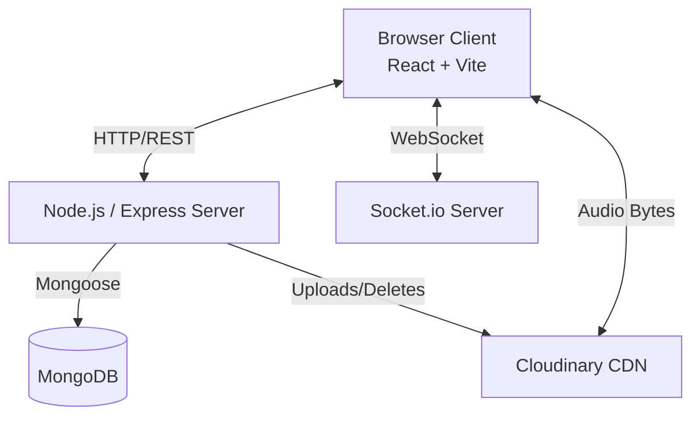

# SyncTunes

SyncTunes is a real-time collaborative music listening web application. Users can create or join rooms and listen to the same audio track in tight synchronization. Any room member can control playback, and a server-authoritative synchronization model is used to eliminate client-side drift and ensure a seamless shared listening experience.

## System Architecture

The application is built using the MERN stack (MongoDB, Express, React, Node.js) with WebSockets (Socket.io) for real-time bidirectional communication.



**Key Architectural Decisions:**
- **Decoupled Audio Delivery:** The Node.js backend does *not* proxy audio streams. Clients stream audio directly from the Cloudinary CDN using the stored `secure_url`. The Express server only handles file uploads (which are forwarded to Cloudinary) and metadata storage.
- **Server-Authoritative Synchronization:** The server holds the absolute truth for playback state (`startedAtServerTime`, `pausedAtOffsetMs`, `isPlaying`). Clients compute their local playback position based on the server's state and their estimated network offset.

## Core Technical Concepts

### 1. Clock Synchronization (NTP Style)
To ensure all clients play the audio at the exact same time, SyncTunes estimates the time difference (clock offset) between the client and the server.
- The client emits a `clock:sync` event containing its local timestamp `clientT0`.
- The server responds with `serverT1` (when request was received) and `serverT2` (when response was sent).
- The client records `clientT3` upon receiving the response.
- The **Round Trip Time (RTT)** is calculated as `(clientT3 - clientT0) - (serverT2 - serverT1)`.
- The **Clock Offset** is calculated as `((serverT1 - clientT0) + (serverT2 - clientT3)) / 2`.
- A smoothed moving average of the last several offsets is maintained for stability.

### 2. Drift Correction Loop
Clients run a background loop that periodically compares their `audio.currentTime` with the expected server-calculated playback position. 
- If the local audio drifts beyond an acceptable threshold (e.g., 500ms) due to buffering, CPU scheduling, or browser background tab throttling, the client forcibly seeks `audio.currentTime` to snap back into synchronization.

### 3. Concurrency Control (`actionSequence`)
To prevent race conditions when multiple users attempt to control playback simultaneously (e.g., two users pause at the exact same time):
- The server maintains a monotonically increasing `actionSequence` integer for each room.
- Every playback action (play, pause, seek, track change) emitted by a client must include its current `actionSequence`.
- If the sequence matches the server's current sequence, the action is accepted, state is mutated, the sequence increments, and the new state is broadcast.
- If a client submits a stale action (sequence mismatch), the server rejects it and forces the client to resync to the current authoritative state.

## Technologies Used

### Frontend (Client)
- **React 18** via Vite
- **TailwindCSS 4** for styling
- **Zustand** for lightweight global state management (`authStore`, `roomStore`, `playerStore`)
- **Socket.io-client** for real-time events
- **Axios** for REST API communication
- **React Router v6** for navigation
- **Howler / HTML5 Audio** for media playback

### Backend (Server)
- **Node.js & Express.js**
- **Socket.io** for WebSockets and rooms support
- **Mongoose** (MongoDB Object Data Modeling)
- **Cloudinary SDK** for direct audio file upload and CDN delivery
- **Multer** for multipart/form-data upload handling (with size and format validation)
- **JWT (JSON Web Tokens)** & **Bcryptjs** for Authentication
- **YouTube Integrations:** `@distube/ytdl-core`, `yt-search`

## Directory Structure

```text
synctunes-YT/
├── client/                     # React Frontend
│   ├── src/
│   │   ├── api/                # Axios interceptors and REST API calls
│   │   ├── components/         # Reusable UI components
│   │   ├── hooks/              # Custom React hooks (e.g., useClockSync, useDriftCorrection)
│   │   ├── pages/              # Route level components
│   │   ├── socket/             # Socket.io client singleton
│   │   ├── stores/             # Zustand state stores
│   │   └── utils/              # Helper functions
│   ├── package.json
│   └── vite.config.js
│
├── server/                     # Node.js Backend
│   ├── src/
│   │   ├── config/             # DB & Cloudinary configuration
│   │   ├── controllers/        # REST route handlers
│   │   ├── middleware/         # Auth verification, Multer upload guards
│   │   ├── models/             # Mongoose schemas (User, Room, Track)
│   │   ├── routes/             # Express routers
│   │   ├── socket/             # Socket.io event handlers
│   │   └── utils/              # Helper utilities
│   ├── package.json
│   └── index.js
│
├── design.md                   # System Design Document
├── requirements.md             # Functional Requirements
└── tasks.md                    # Implementation Tasks Tracking
```

## Setup & Installation

### 1. Prerequisites
- Node.js (v18+ recommended)
- MongoDB instance (local or Atlas)
- Cloudinary Account (for audio storage)

### 2. Environment Variables

**Server (`server/.env`):**
```env
PORT=4000
MONGO_URI=mongodb://127.0.0.1:27017/synctunes
JWT_SECRET=your_super_secret_key
CLOUDINARY_CLOUD_NAME=your_cloud_name
CLOUDINARY_API_KEY=your_api_key
CLOUDINARY_API_SECRET=your_api_secret
CLIENT_ORIGIN=http://localhost:5173
```

**Client (`client/.env`):**
```env
VITE_API_URL=http://localhost:4000/api
VITE_SOCKET_URL=http://localhost:4000
```

### 3. Running Locally

1. **Install Dependencies:**
   ```bash
   cd server && npm install
   cd ../client && npm install
   ```
2. **Start Backend Server:**
   ```bash
   cd server
   npm run dev
   ```
3. **Start Frontend Dev Server:**
   ```bash
   cd client
   npm run dev
   ```

## WebSocket Events

| Namespace | Event | Direction | Description |
|-----------|-------|-----------|-------------|
| **Clock** | `clock:sync` | C → S | Initiates time sync protocol. |
| **Clock** | `clock:syncResponse` | S → C | Returns server timing information. |
| **Room**  | `room:join` | C → S | Request to join a room by ID/Join Code. |
| **Room**  | `room:memberUpdate`| S → C | Broadcasts changes to room member list. |
| **Room**  | `room:staleAction` | S → C | Sent when a client's actionSequence is out of date. |
| **Media** | `playback:play` | C → S | Requests to play audio. |
| **Media** | `playback:pause` | C → S | Requests to pause audio. |
| **Media** | `playback:seek` | C → S | Requests to seek to a specific timestamp. |
| **Media** | `playback:trackChange`| C → S | Changes the current active track. |
| **Media** | `playback:heartbeat`| C → S | Request for authoritative playback state from server. |
